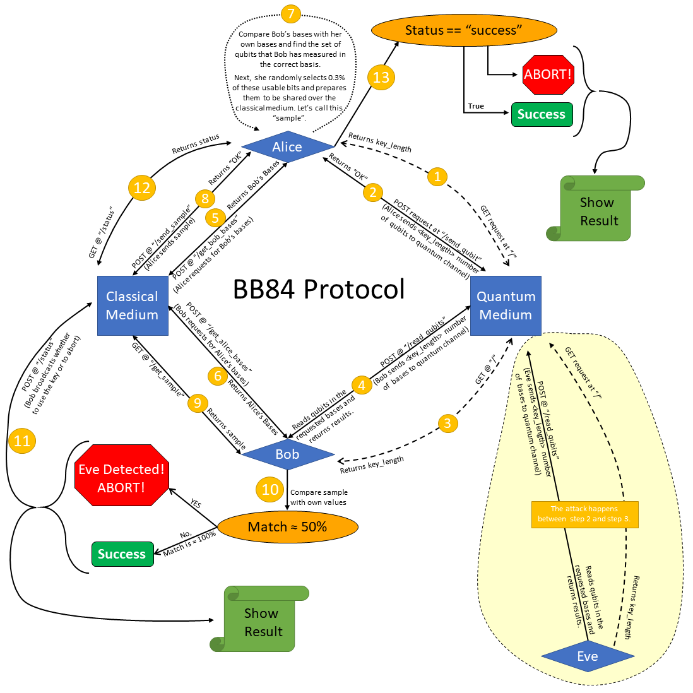

# Simulating BB84

&emsp; We are trying to implement BB84 Quantum Key Distribution protocol in Python. We plan to use **Flask** and **Qiskit** libraries of Python to achieve this.

## Files

&emsp; Description of all the files in this folder:

### Important Files

&emsp; We have five important files:

1. [**"quantumMedium.py":**](./quantumMedium.py) This is the quantum medium through which the 3 three parties (Alice, Bob and Eve) will communicate with each other.
2. [**"classicalMedium.py":**](./classicalMedium.py) This is the classical medium through which the 3 three parties (alice, bob and eve) will communicate with each other after they have communicated the qubit away.
3. [**"alice.py":**](./alice.py) This is Alice. She will use this code to carry out the communication throught the two above mentioned mediums.
4. [**"bob.py":**](./bob.py) Similarly this is the code for Bob.
5. [**"eve.py":**](./eve.py) Similarly this is the code for Eve.

### Not-so-Important Files

&emsp; We have two more Not-so-Important files.

1. [**"README.md":**](./README.md) It is this file!
2. [**"tries.ipynb":**](./tries.ipynb) I used this jupyter notebook to write all the trash codes to try out things.

## About BB84

&emsp; BB84 is a QKD Protocol based on the quantum phenomenon of **superposition**. According to Google, **"superposition is the ability of a quantum system to be in multiple states at the same time until it is measured"**. Here Alice will send qubits to Bob through a quantum channel. If Eve tries to evesdrop on the channel, Alice and Bob have a process by which they will be able to detect the presence of Eve in the channel. Hence they will discard the transmitted key and try again to evade Eve.

### Steps

1. Alice will prepare the qubits in either of two bases (+ or ×). The idea is, if the person who measures the qubit, measures it in the right basis (the same basis it was prepared in), he will have a *100% chance of reading its value (either 0 or 1) correctly. If a qubit is measured in the wrong basis, he will get a random result out of 0 and 1.
2. Alice sends these prepared qubits to Bob throught a quantum medium.
3. Bob doesn't know which qubit was prepared in which basis. So everytime while reading a qubit, he randomly chooses a basis and measures the qubit in that randomly chosen basis. Note that, as there are only 2 bases in which Alice can prepare the qubits, Bob, while reading will have 50% chance of reading a qubit in its correct basis.
4. Now, after the Qubits have been read, and destroyed, so that no one can measure them any more, Bob tells Alice the bases in which he measured which qubit. He uses a classical channel to do this. Alice also tells Bob the bases she used to prepare the qubits over the same classical channel. So, both of them know which qubits were measured in the correct base and which weren't. So, now they decide to discard the qubits which were measured in the wrong base and proceed with the ones which are guaranteed to be measured correctly. Note that, the classical medium is a public medium in which everyone can see everyone else's message, but, there is no way, they can impersonate one-another.
5. If everything had gone correctly till this point, and Eve hasn't done any of his mischievous activities, Alice and Bob should have two identical keys with them. So, just to verify this fact, Alice randomly chooses some of her bits, and reveals them to Bob through the classical channel. Bob, compares them with his own bits.
6. If Eve wasn't there, Bob must have got a *100% match. Else, if Bob measures a reduced match percentage, he can conclude that Eve must have indulged into the process.

**How Eve can try to Evesdrop:**

7. Suppose Eve intercepts the quantum medium and measures the qubits in some random choice of basis before Bob. So, she has a 50% chance of reading the qubits in its correct basis. Now, if Eve doesn't read a qubit in ist correct basis, she is bound to disturb its state. The qubit will collapse to the value she reads and in the basis she reads it.
8. Now, let us fast forward to step 5, Bob, compares Alice's **Sample** with his own. Now, among the bases measured in the same basis as Alice had prepared it, Bob will measure the qubits and get the correct value if and only if Eve has also measured them in the correct basis. Chance of that to happen is 50%. So, while doing step 6, if Bob finds that the **Sample** sent by Alice matches his one only by around 50% (which was supposed to be a *100% match), he will declare that the Key was compromised, and the process will again start from step 1.

 \* **100%:** This value is theoretically 100%, but practically this value goes down by some percentages due to errors in quantum systems.

## Explanation for the Code



 1. Alice asks Quantum Medium to get the length of the Key to be sent.
 2. Alice sends that many number of qubits to the quantum medium.
 2.5. (Optional) Eve can ask the Quantum medium for the length of the Key and send those many bases to Quantum Medium to be read.
 3. Bob asks Quantum Medium to get the length of the Key to be read.
 4. Bob sends those many choices of bases to quantum medium. The quantum medium reads those bases in the desired medium and returns them to Bob.
 5. Alice sends her bases to the Classical Medium, and in return gets Bob's bases
 6. Bob also sends his, and in return he gets Alice's bases. (Note, suppose Alice requests the server for Bob's bases by giving her own bases, but Bob hasn't given his bases to the classical medium yet. So, classical medium will make Alice wait till Bob sends his bases)
 7. Alice randomly choses a part of the bits which has been read by Bob in the correct basis and makes a **Sample** of base-value pairs.
 8. Alice sends the **Sample** to Classical Medium.
 9. Bob gets the **Sample** from Classical Medium.
 10. Bob matches his own qubits with the **Sample** of Alice.
 11. Bob decides whether to Abort or to Use the Key. He tells his decision to the Classical Medium
 12. Alice gets to know about the decision made by Bob.
 13. Alice acts accordingly.

# Code Results

## When Eve does not intercept:

**"quantumMedium.py":** 

```
PS C:\Users\amukh\Desktop\QKD\BB84_1> python .\quantumMedium.py
 * Serving Flask app 'quantumMedium' (lazy loading)
 * Environment: production
 * Debug mode: on
 * Restarting with stat
 * Debugger is active!
 * Debugger PIN: 108-787-847
 * Running on http://localhost:5050/ (Press CTRL+C to quit)
someone asks for the key-length, Quantum Medium return 2500
127.0.0.1 - - [19/Jul/2022 10:07:55] "GET / HTTP/1.1" 200 -
someone asks for the key-length, Quantum Medium return 2500
127.0.0.1 - - [19/Jul/2022 10:07:55] "GET / HTTP/1.1" 200 -

Alice sends all the 2500 qubit
100%|████████████████████████████████| 2500/2500 [00:00<00:00, 8338.95it/s]
127.0.0.1 - - [19/Jul/2022 10:07:57] "POST /send_qubit HTTP/1.1" 200 -

Someone measures the qubits in his/her choice of bases.
100%|█████████████████████████████████| 2500/2500 [00:21<00:00, 116.72it/s]
127.0.0.1 - - [19/Jul/2022 10:08:19] "POST /read_qubits HTTP/1.1" 200 -
```

**"classicalMedium.py":** 

```
PS C:\Users\amukh\Desktop\QKD\BB84_1> python .\classicalMedium.py
 * Serving Flask app 'classicalMedium' (lazy loading)
 * Environment: production
 * Debug mode: on
 * Restarting with stat
 * Debugger is active!
 * Debugger PIN: 108-787-847
 * Running on http://localhost:5000/ (Press CTRL+C to quit)

Alice sent her bases and is requesting for Bob's bases. But Bob hasn't sent his bases yet, so she waits.
127.0.0.1 - - [19/Jul/2022 10:07:59] "POST /get_bob_bases HTTP/1.1" 200 -

Bob sent his bases and is requesting for Alice's bases. The Classical Medium already has Alice's bases, so it gives it to him.
127.0.0.1 - - [19/Jul/2022 10:08:21] "POST /get_alice_bases HTTP/1.1" 200 -

Alice sent her bases and is requesting for Bob's bases. The Classical Medium already has Bob's bases, so it gives it to her.
127.0.0.1 - - [19/Jul/2022 10:08:22] "POST /get_bob_bases HTTP/1.1" 200 -

Bob is requesting for Alice's sample. But Alice hasn't sent her sample yet, so he waits.
127.0.0.1 - - [19/Jul/2022 10:08:23] "GET /get_sample HTTP/1.1" 200 -

Alice sent her sample.
127.0.0.1 - - [19/Jul/2022 10:08:24] "POST /send_sample HTTP/1.1" 200 -

Bob is requesting for Alice's sample. The Classical Medium already has Alice's sample, so it gives it to him.
127.0.0.1 - - [19/Jul/2022 10:08:26] "GET /get_sample HTTP/1.1" 200 -

Alice is requesting for Bob's decision on whether to proceed with the key or start the process of resending another key.
But Bob hasn't sent his decision yet, so she waits.
127.0.0.1 - - [19/Jul/2022 10:08:26] "GET /status HTTP/1.1" 200 -

Bob is sending his decision on whether to proceed with the key or start the process of resending another key.
127.0.0.1 - - [19/Jul/2022 10:08:28] "POST /status HTTP/1.1" 200 -

Alice is requesting for Bob's decision on whether to proceed with the key or start the process of resending another key.
The Classical Medium already has Bob's decision, so it gives it to her.
127.0.0.1 - - [19/Jul/2022 10:08:33] "GET /status HTTP/1.1" 200 -
```

**"alice.py":** 

```
PS C:\Users\amukh\Desktop\QKD\BB84_1> python .\bob.py
Hi! This is Bob!
match = 100.0%
Success
key length = 929
key = 01000110101101111111001011101101000111100010010101000011010110011
10111111111101000000010111010101001110001010101110011001011111000010011
00110100101101111000001001110001111100100110111110010011101100010110010
10010011110010010111011101101110100011100110101101111101000010011011010
01101000100011000010100011011011100011101110011110100000110111000000010
10011101000010011001111110111010001111001001111111011101101100000011010
10010110111101011011010010001000000010110100100000011000110101100010100
00100110010110001100000110101010011010111010101011110010000100110100111
00011111111111100111111010111101101111010100111111111110111011111010010
01011011011001100111001110011110010100011010010011110000111111111100101
10110000001001011010111110100011001100000011011000000111100110110001011
10010010101111111000111011101110110111111100100001101110011000111000111
00100001110110110010110000000100110101011111011100000000100111010111001
111100001101
```

**"bob.py":** 

```
Hi! This is Alice!
sample length = 375
key = 01000110101101111111001011101101000111100010010101000011010110011
10111111111101000000010111010101001110001010101110011001011111000010011
00110100101101111000001001110001111100100110111110010011101100010110010
10010011110010010111011101101110100011100110101101111101000010011011010
01101000100011000010100011011011100011101110011110100000110111000000010
10011101000010011001111110111010001111001001111111011101101100000011010
10010110111101011011010010001000000010110100100000011000110101100010100
00100110010110001100000110101010011010111010101011110010000100110100111
00011111111111100111111010111101101111010100111111111110111011111010010
01011011011001100111001110011110010100011010010011110000111111111100101
10110000001001011010111110100011001100000011011000000111100110110001011
10010010101111111000111011101110110111111100100001101110011000111000111
00100001110110110010110000000100110101011111011100000000100111010111001
111100001101
```


## When Eve intercepts:
**"quantumMedium.py":** 

```
PS C:\Users\amukh\Desktop\QKD\BB84_1> python .\quantumMedium.py
 * Serving Flask app 'quantumMedium' (lazy loading)
 * Environment: production
 * Debug mode: on
 * Restarting with stat
 * Debugger is active!
 * Debugger PIN: 108-787-847
 * Running on http://localhost:5050/ (Press CTRL+C to quit)
someone asks for the key-length, Quantum Medium return 2500
127.0.0.1 - - [19/Jul/2022 10:02:23] "GET / HTTP/1.1" 200 -

Alice sends all the 2500 qubit
100%|████████████████████████████████| 2500/2500 [00:00<00:00, 7175.33it/s]
127.0.0.1 - - [19/Jul/2022 10:02:26] "POST /send_qubit HTTP/1.1" 200 -
someone asks for the key-length, Quantum Medium return 2500
127.0.0.1 - - [19/Jul/2022 10:02:31] "GET / HTTP/1.1" 200 -

Someone measures the qubits in his/her choice of bases.
100%|█████████████████████████████████| 2500/2500 [00:24<00:00, 101.28it/s]
127.0.0.1 - - [19/Jul/2022 10:02:58] "POST /read_qubits HTTP/1.1" 200 -
someone asks for the key-length, Quantum Medium return 2500
127.0.0.1 - - [19/Jul/2022 10:03:07] "GET / HTTP/1.1" 200 -

Someone measures the qubits in his/her choice of bases.
100%|█████████████████████████████████| 2500/2500 [00:23<00:00, 104.44it/s]
127.0.0.1 - - [19/Jul/2022 10:03:33] "POST /read_qubits HTTP/1.1" 200 -
```

**"classicalMedium.py":** 

```
PS C:\Users\amukh\Desktop\QKD\BB84_1> python .\classicalMedium.py
 * Serving Flask app 'classicalMedium' (lazy loading)
 * Environment: production
 * Debug mode: on
 * Restarting with stat
 * Debugger is active!
 * Debugger PIN: 108-787-847
 * Running on http://localhost:5000/ (Press CTRL+C to quit)

Alice sent her bases and is requesting for Bob's bases. But Bob hasn't sent his bases yet, so she waits.
127.0.0.1 - - [19/Jul/2022 10:02:28] "POST /get_bob_bases HTTP/1.1" 200 -

Alice sent her bases and is requesting for Bob's bases. But Bob hasn't sent his bases yet, so she waits.
127.0.0.1 - - [19/Jul/2022 10:02:51] "POST /get_bob_bases HTTP/1.1" 200 -

Alice sent her bases and is requesting for Bob's bases. But Bob hasn't sent his bases yet, so she waits.
127.0.0.1 - - [19/Jul/2022 10:03:13] "POST /get_bob_bases HTTP/1.1" 200 -

Bob sent his bases and is requesting for Alice's bases. The Classical Medium already has Alice's bases, so it gives it to him.
127.0.0.1 - - [19/Jul/2022 10:03:35] "POST /get_alice_bases HTTP/1.1" 200 -

Alice sent her bases and is requesting for Bob's bases. The Classical Medium already has Bob's bases, so it gives it to her.
127.0.0.1 - - [19/Jul/2022 10:03:36] "POST /get_bob_bases HTTP/1.1" 200 -

Bob is requesting for Alice's sample. But Alice hasn't sent her sample yet, so he waits.
127.0.0.1 - - [19/Jul/2022 10:03:37] "GET /get_sample HTTP/1.1" 200 -

Alice sent her sample.
127.0.0.1 - - [19/Jul/2022 10:03:38] "POST /send_sample HTTP/1.1" 200 -

Bob is requesting for Alice's sample. The Classical Medium already has Alice's sample, so it gives it to him.
127.0.0.1 - - [19/Jul/2022 10:03:40] "GET /get_sample HTTP/1.1" 200 -

Alice is requesting for Bob's decision on whether to proceed with the key or start the process of resending another key.
But Bob hasn't sent his decision yet, so she waits.
127.0.0.1 - - [19/Jul/2022 10:03:40] "GET /status HTTP/1.1" 200 -

Bob is sending his decision on whether to proceed with the key or start the process of resending another key.
127.0.0.1 - - [19/Jul/2022 10:03:42] "POST /status HTTP/1.1" 200 -

Alice is requesting for Bob's decision on whether to proceed with the key or start the process of resending another key.
The Classical Medium already has Bob's decision, so it gives it to her.
127.0.0.1 - - [19/Jul/2022 10:03:47] "GET /status HTTP/1.1" 200 -
```

**"eve.py":** 

```
PS C:\Users\amukh\Desktop\QKD\BB84_1> python .\eve.py
Hi! This is Eve!
completed eavesdropping!
```

**"alice.py":** 

```
PS C:\Users\amukh\Desktop\QKD\BB84_1> python .\alice.py
Hi! This is Alice!
sample length = 375
Eve Detected, mission abort!
```

**"bob.py":** 

```
PS C:\Users\amukh\Desktop\QKD\BB84_1> python .\bob.py
Hi! This is Bob!
match = 59.46666666666667%
Eve Detected, mission abort!
```
