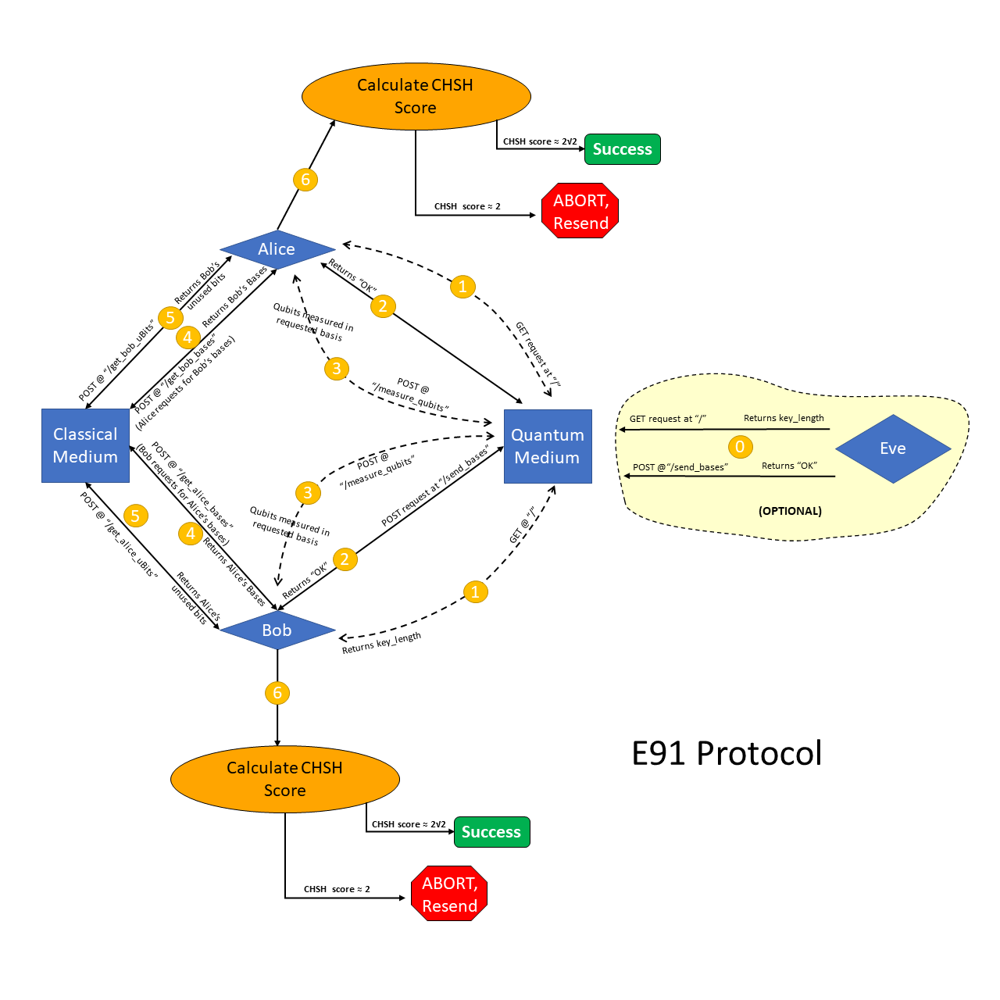

# Simulating E91

&emsp; We are trying to implement E91 Quantum Key Distribution protocol in Python. We plan to use **Flask** and **Qiskit** libraries of Python to achieve this.

## Files

&emsp; We have written the following 6 files for simulating E91. We have used Flask, Requests and Qiskit python modules to complete the task:

1. [**"quantumMedium.py":**](./quantumMedium.py) This is the quantum medium through which the 3 three parties (Alice, Bob and Eve) will communicate with each other.
2. [**"classicalMedium.py":**](./classicalMedium.py) This is the classical medium through which the 3 three parties (alice, bob and eve) will communicate with each other after they have communicated the qubit away.
3. [**"module.py":**](./module.py) We can clearly see that most parts of the codes for Alice, Bob and Eve are similar. So we decided to write all the important functions and put them in this file. Thus the codes for Alice and Bob will be smaller and more readable.
4. [**"alice.py":**](./alice.py) Code to be used by Alice.
5. [**"bob.py":**](./bob.py) Code to be used by Bob.
6. [**"eve.py":**](./eve.py) Code to be used by Eve.

## Explanation for the Code



0. (Optional) Eve gets to know the number_of_singlets from Quantum Medium. She then sends her choice of bases to Quantum Medium.
1. Alice and Bob get to know the number_of_singlets from Quantum Medium.
2. Alice and Bob send their choice of bases to the Quantum Medium one by one. As soon as Quantum Medium has the choice of bases from Alice and Bob (whether or not Eve has sent her bases), Quantum Medium measures the singlets. If Eve has sent her choice of bases before this time, her measurements are made before that of Alice and Bob.
3. Quantum Medium has measured the qubits according to everyone's choices of bases. Now Bob and Alice request it to return the measurement outcomes.
4. Alice and Bob share their choices of bases through the classical medium.
5. Alice and Bob share their unused bits through the classical medium for the calculation of CHSH test statistic.
6. Finally they individually calculate the CHSH test statistic. Depending on the obtained value, they decide whether to use the established key or to start the process all over again.

# Code Results

## When Eve does not intercept:

**"quantumMedium.py":** 

```
PS C:\Users\amukh\Desktop\QKD\E91> python .\quantumMedium.py
 * Serving Flask app 'quantumMedium' (lazy loading)
 * Environment: production
   WARNING: This is a development server. Do not use it in a production deployment.
   Use a production WSGI server instead.
 * Debug mode: on
 * Restarting with stat
 * Debugger is active!
 * Debugger PIN: 108-787-847
 * Running on http://localhost:5001/ (Press CTRL+C to quit)

someone asked for the number of singlets... returned 2000
127.0.0.1 - - [19/Jul/2022 10:30:08] "GET / HTTP/1.1" 200 -

Alice sent choice of bases
127.0.0.1 - - [19/Jul/2022 10:30:10] "POST /send_bases HTTP/1.1" 200 -

someone asked for the number of singlets... returned 2000
127.0.0.1 - - [19/Jul/2022 10:30:10] "GET / HTTP/1.1" 200 -

Alice is requesting for the measurements. But measurements are not ready yet, so Quantum Medium requests
 him/her to wait a bit before asking again!
127.0.0.1 - - [19/Jul/2022 10:30:12] "POST /measure_qubits HTTP/1.1" 200 -

Bob sent choice of bases

As the Quantum Medium has both the bases of Alice and Bob, it can start making measurements...

Alice is requesting for the measurements. But measurements are not ready yet, so Quantum Medium requests
 him/her to wait a bit before asking again!
127.0.0.1 - - [19/Jul/2022 10:30:24] "POST /measure_qubits HTTP/1.1" 200 -

Alice is requesting for the measurements. But measurements are not ready yet, so Quantum Medium requests
 him/her to wait a bit before asking again!
127.0.0.1 - - [19/Jul/2022 10:30:36] "POST /measure_qubits HTTP/1.1" 200 -

Alice is requesting for the measurements. But measurements are not ready yet, so Quantum Medium requests
 him/her to wait a bit before asking again!
127.0.0.1 - - [19/Jul/2022 10:31:03] "POST /measure_qubits HTTP/1.1" 200 -

measurements completed!
127.0.0.1 - - [19/Jul/2022 10:31:03] "POST /send_bases HTTP/1.1" 200 -

Bob is requesting for the measurements. Measurements are now ready, so Quantum Medium is  returning the 
results.
127.0.0.1 - - [19/Jul/2022 10:31:05] "POST /measure_qubits HTTP/1.1" 200 -

Alice is requesting for the measurements. Measurements are now ready, so Quantum Medium is  returning the 
results.
127.0.0.1 - - [19/Jul/2022 10:31:15] "POST /measure_qubits HTTP/1.1" 200 -
```

**"classicalMedium.py":** 

```
PS C:\Users\amukh\Desktop\QKD\E91> python .\classicalMedium.py
 * Serving Flask app 'classicalMedium' (lazy loading)
 * Environment: production
   WARNING: This is a development server. Do not use it in a production deployment.
   Use a production WSGI server instead.
 * Debug mode: on
 * Restarting with stat
 * Debugger is active!
 * Debugger PIN: 108-787-847
 * Running on http://localhost:5000/ (Press CTRL+C to quit)

Bob sent his bases and is requesting for Alice's bases. But Alice hasn't sent her bases yet, so he waits.
127.0.0.1 - - [19/Jul/2022 10:31:07] "POST /get_alice_bases HTTP/1.1" 200 -

Bob sent his bases and is requesting for Alice's bases. But Alice hasn't sent her bases yet, so he waits.
127.0.0.1 - - [19/Jul/2022 10:31:10] "POST /get_alice_bases HTTP/1.1" 200 -

Bob sent his bases and is requesting for Alice's bases. But Alice hasn't sent her bases yet, so he waits.
127.0.0.1 - - [19/Jul/2022 10:31:13] "POST /get_alice_bases HTTP/1.1" 200 -

Bob sent his bases and is requesting for Alice's bases. But Alice hasn't sent her bases yet, so he waits.
127.0.0.1 - - [19/Jul/2022 10:31:16] "POST /get_alice_bases HTTP/1.1" 200 -

Alice sent her bases and is requesting for Bob's bases. The Classical Medium already has Bob's bases, so 
it gives it to her.
127.0.0.1 - - [19/Jul/2022 10:31:17] "POST /get_bob_bases HTTP/1.1" 200 -

Alice sent her unused Bits and is requesting for Bob's unused Bits. But Bob hasn't sent his unused Bits yet, 
so she waits.
127.0.0.1 - - [19/Jul/2022 10:31:19] "POST /get_bob_uBits HTTP/1.1" 200 -

Bob sent his bases and is requesting for Alice's bases. The Classical Medium already has Alice's bases, so 
it gives it to him.
127.0.0.1 - - [19/Jul/2022 10:31:19] "POST /get_alice_bases HTTP/1.1" 200 -

Bob sent his unused Bits and is requesting for Alice's unused Bits. The Classical Medium already has Alice's 
unused Bits, so it gives it to him.
127.0.0.1 - - [19/Jul/2022 10:31:21] "POST /get_alice_uBits HTTP/1.1" 200 -

Alice sent her unused Bits and is requesting for Bob's unused Bits. The Classical Medium already has Bob's 
unused Bits, so it gives it to her.
127.0.0.1 - - [19/Jul/2022 10:31:22] "POST /get_bob_uBits HTTP/1.1" 200 -
```

**"alice.py":** 

```
Hi! This is Alice!
Sending bases...
Reading qubits...
Reading qubits...
Reading qubits...
Reading qubits...
Reading qubits...
chsh score: -2.831877117951897
00100000110101011111000010011010001001010000011000010000000000010100010
11010001011101000011010000100100110001100100010100010011011101100101000
10001101000100100010110010011111001110001111101001011010100101110111000
10111111010001111000101100101001101010111011110000101100110010001010100
00001000111010010001110111000100100011000101010001101000110110101000001
01100001001101011001101100010010100100110011111001011101011010110110110
1010101101
```

**"bob.py":** 

```
PS C:\Users\amukh\Desktop\QKD\E91> python .\bob.py
Hi! This is Bob!
Sending bases...
Reading qubits...
chsh score: -2.831877117951897
00100000110101011111000010011010001001010000011000010000000000010100010
11010001011101000011010000100100110001100100010100010011011101100101000
10001101000100100010110010011111001110001111101001011010100101110111000
10111111010001111000101100101001101010111011110000101100110010001010100
00001000111010010001110111000100100011000101010001101000110110101000001
01100001001101011001101100010010100100110011111001011101011010110110110
1010101101
```

## When Eve intercepts:
**"quantumMedium.py":** 

```
PS C:\Users\amukh\Desktop\QKD\E91> python .\quantumMedium.py
 * Serving Flask app 'quantumMedium' (lazy loading)
 * Environment: production
   WARNING: This is a development server. Do not use it in a production deployment.
   Use a production WSGI server instead.
 * Debug mode: on
 * Restarting with stat
 * Debugger is active!
 * Debugger PIN: 108-787-847
 * Running on http://localhost:5001/ (Press CTRL+C to quit)

someone asked for the number of singlets... returned 2000
127.0.0.1 - - [19/Jul/2022 10:35:08] "GET / HTTP/1.1" 200 -

Eve sent choice of bases
127.0.0.1 - - [19/Jul/2022 10:35:10] "POST /send_bases HTTP/1.1" 200 -

someone asked for the number of singlets... returned 2000
127.0.0.1 - - [19/Jul/2022 10:35:34] "GET / HTTP/1.1" 200 -

someone asked for the number of singlets... returned 2000
127.0.0.1 - - [19/Jul/2022 10:35:34] "GET / HTTP/1.1" 200 -

Alice sent choice of bases
127.0.0.1 - - [19/Jul/2022 10:35:36] "POST /send_bases HTTP/1.1" 200 -

Bob sent choice of bases

As the Quantum Medium has both the bases of Alice and Bob, it can start making measurements...

Alice is requesting for the measurements. But measurements are not ready yet, so Quantum Medium 
requests him/her to wait a bit before asking again!
127.0.0.1 - - [19/Jul/2022 10:35:38] "POST /measure_qubits HTTP/1.1" 200 -

Alice is requesting for the measurements. But measurements are not ready yet, so Quantum Medium 
requests him/her to wait a bit before asking again!
127.0.0.1 - - [19/Jul/2022 10:35:50] "POST /measure_qubits HTTP/1.1" 200 -

Alice is requesting for the measurements. But measurements are not ready yet, so Quantum Medium 
requests him/her to wait a bit before asking again!
127.0.0.1 - - [19/Jul/2022 10:36:02] "POST /measure_qubits HTTP/1.1" 200 -

Alice is requesting for the measurements. But measurements are not ready yet, so Quantum Medium 
requests him/her to wait a bit before asking again!
127.0.0.1 - - [19/Jul/2022 10:36:28] "POST /measure_qubits HTTP/1.1" 200 -

measurements completed!
127.0.0.1 - - [19/Jul/2022 10:36:28] "POST /send_bases HTTP/1.1" 200 -

Bob is requesting for the measurements. Measurements are now ready, so Quantum Medium is  returning 
the results.
127.0.0.1 - - [19/Jul/2022 10:36:30] "POST /measure_qubits HTTP/1.1" 200 -

Alice is requesting for the measurements. Measurements are now ready, so Quantum Medium is  returning 
the results.
127.0.0.1 - - [19/Jul/2022 10:36:40] "POST /measure_qubits HTTP/1.1" 200 -
```

**"classicalMedium.py":** 

```
PS C:\Users\amukh\Desktop\QKD\E91> python .\classicalMedium.py
 * Serving Flask app 'classicalMedium' (lazy loading)
 * Environment: production
   WARNING: This is a development server. Do not use it in a production deployment.
   Use a production WSGI server instead.
 * Debug mode: on
 * Restarting with stat
 * Debugger is active!
 * Debugger PIN: 108-787-847
 * Running on http://localhost:5000/ (Press CTRL+C to quit)

Bob sent his bases and is requesting for Alice's bases. But Alice hasn't sent her bases yet, so he waits.
127.0.0.1 - - [19/Jul/2022 10:36:32] "POST /get_alice_bases HTTP/1.1" 200 -

Bob sent his bases and is requesting for Alice's bases. But Alice hasn't sent her bases yet, so he waits.
127.0.0.1 - - [19/Jul/2022 10:36:35] "POST /get_alice_bases HTTP/1.1" 200 -

Bob sent his bases and is requesting for Alice's bases. But Alice hasn't sent her bases yet, so he waits.
127.0.0.1 - - [19/Jul/2022 10:36:39] "POST /get_alice_bases HTTP/1.1" 200 -

Bob sent his bases and is requesting for Alice's bases. But Alice hasn't sent her bases yet, so he waits.
127.0.0.1 - - [19/Jul/2022 10:36:42] "POST /get_alice_bases HTTP/1.1" 200 -

Alice sent her bases and is requesting for Bob's bases. The Classical Medium already has Bob's bases, so it 
gives it to her.
127.0.0.1 - - [19/Jul/2022 10:36:42] "POST /get_bob_bases HTTP/1.1" 200 -

Alice sent her unused Bits and is requesting for Bob's unused Bits. But Bob hasn't sent his unused Bits yet, 
so she waits.
127.0.0.1 - - [19/Jul/2022 10:36:44] "POST /get_bob_uBits HTTP/1.1" 200 -

Bob sent his bases and is requesting for Alice's bases. The Classical Medium already has Alice's bases, so 
it gives it to him.
127.0.0.1 - - [19/Jul/2022 10:36:45] "POST /get_alice_bases HTTP/1.1" 200 -

Bob sent his unused Bits and is requesting for Alice's unused Bits. The Classical Medium already has Alice's 
unused Bits, so it gives it to him.
127.0.0.1 - - [19/Jul/2022 10:36:47] "POST /get_alice_uBits HTTP/1.1" 200 -

Alice sent her unused Bits and is requesting for Bob's unused Bits. The Classical Medium already has Bob's 
unused Bits, so it gives it to her.
127.0.0.1 - - [19/Jul/2022 10:36:48] "POST /get_bob_uBits HTTP/1.1" 200 -
```

**"eve.py":** 

```
PS C:\Users\amukh\Desktop\QKD\E91> python .\eve.py
Hi! This is Eve!
Sending bases...
completed eavesdropping!

```

**"alice.py":** 

```
PS C:\Users\amukh\Desktop\QKD\E91> python .\alice.py
Hi! This is Alice!
Sending bases...
Reading qubits...
Reading qubits...
Reading qubits...
Reading qubits...
Reading qubits...
chsh score: -1.9656904472046612
Eve is here! Abort!
```

**"bob.py":** 

```
Hi! This is Bob!
Sending bases...
Reading qubits...
chsh score: -1.9656904472046612
Eve is here! Abort!
```
